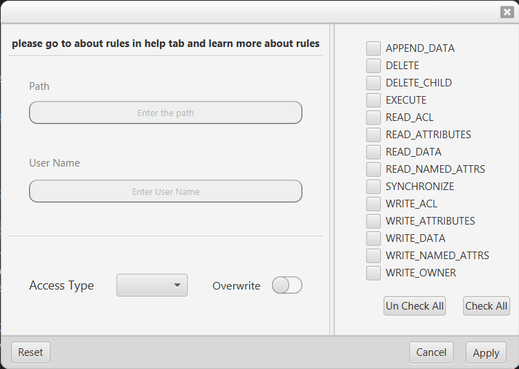

# Access Management Control
<!--Writerside adds this topic when you create a new documentation project.
You can use it as a sandbox to play with Writerside features, and remove it from the TOC when you don't need it anymore.
If you want to re-add it for your experiments, click + to create a new topic, choose Topic from Template, and select the 
"Starter" template.-->
## Start

The main layer of application

<kdd>

</kdd>

### We have three section in this page:

- Menu Bar
- Input text field for entering the files path
- Left side section for tree directory browsing 
- Middle section for showing the result of ACL
- Right side section for showing detail of files and list of permissions

## Menu bar

You can add new rules, search users and do some settings in preferences:

<kdd>

</kdd>

Also, you can get some info about special permission in Help item:

<kdd>

</kdd>

## Add New Rule
Go to `File | New Rule`.

<kdd>

</kdd>

- By default, the selected item in Directory Browser set into Path, but you can change it
- The Username must be entered with domain e.g. (domain\username)
- In Access Type you can select the Allow or Deny of permissions
- With selecting the Overwrite All before permissions will be removed
- By selecting each special permissions in left side you can modify the access

## User Search
Go to `File | Search`.

<kdd>

</kdd>

In the search page you search users by typing their Username 
(If you want to list all exist users, without typing anything just press Enter)

## Preferences
Go to `File | Preferences`.

<kdd>

</kdd>

### Two Algorithms Implemented for Directory Tree

- Lazy Loading
- Full Fetch

#### Lazy Loading

Listing files and folders for so many counts causes time consumption in the Application,
So to avoid time consumption we just list the directories and files in depth of one, and Items just load by selecting each folder in time

#### Full Fetch

If the number of files and folders less then you can list all of them and use it.
By default, Full Fetch is Enable

## About Rules
Go to `Help | About Rules`.

<kdd>

</kdd>

This table shows the group of special permissions

## Feedback

You can also always send an email [hadi137913@gmail.com](mailto:hadi137913@gmail.com), [ali.kxt270@gmail.com](mailto:ali.kxt270@gmail.com).

